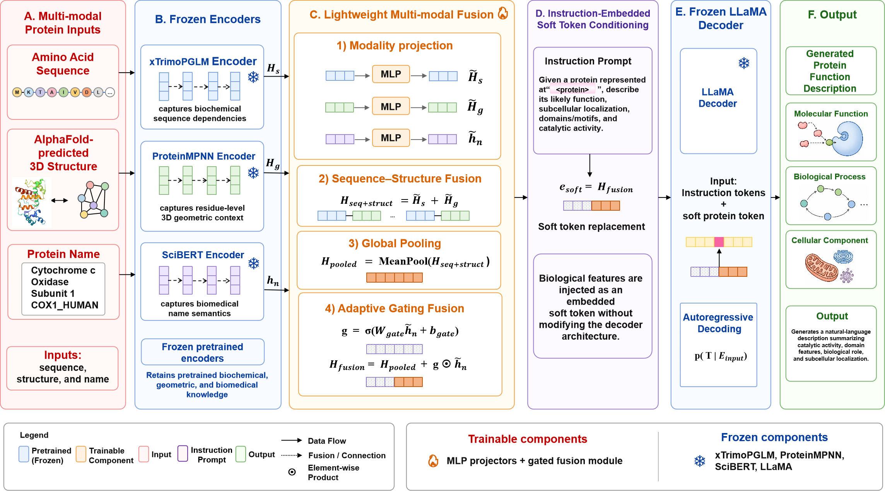

# abstract
Recent advances in Large Language Models (LLMs) have introduced new opportunities for protein function prediction by integrating semantic reasoning beyond conventional sequence-based inference. However, current approaches remain largely classification-based and overlook structural and semantic protein information. To address this, we propose Struct2Func, a text enhanced large language model framework that performs instruction-based semantic augmentation to align multimodal protein representations. These aligned embeddings are fused through a lightweight projection mechanism and conditioned into a protein-adapted LLaMA decoder using instruction-driven soft token prompts, enabling precise and descriptive protein function generation. As a result, Struct2Func captures complex relationships between multimodal protein features and functional semantics, improving its overall protein function generation capability. On the SwissProt benchmark with natural language protein oriented instruction templates, Struct2Func improves the ROUGE-L score by 14.7 points over the state-of-the-art model. These findings validate the effectiveness of text-enhanced multimodal representation fusion and underscore the potential of Struct2Func for detailed and biologically coherent protein function generation.
	

# Data Processing
You should download the origin ProteinMPNN, xTrimoPGLM and llama-molinst-protein-7b model before process data.
```python
python preprocess_data.py
```
# Model Training
```python
python train.py
```
# Evaluate
```python
python eval.py
```
